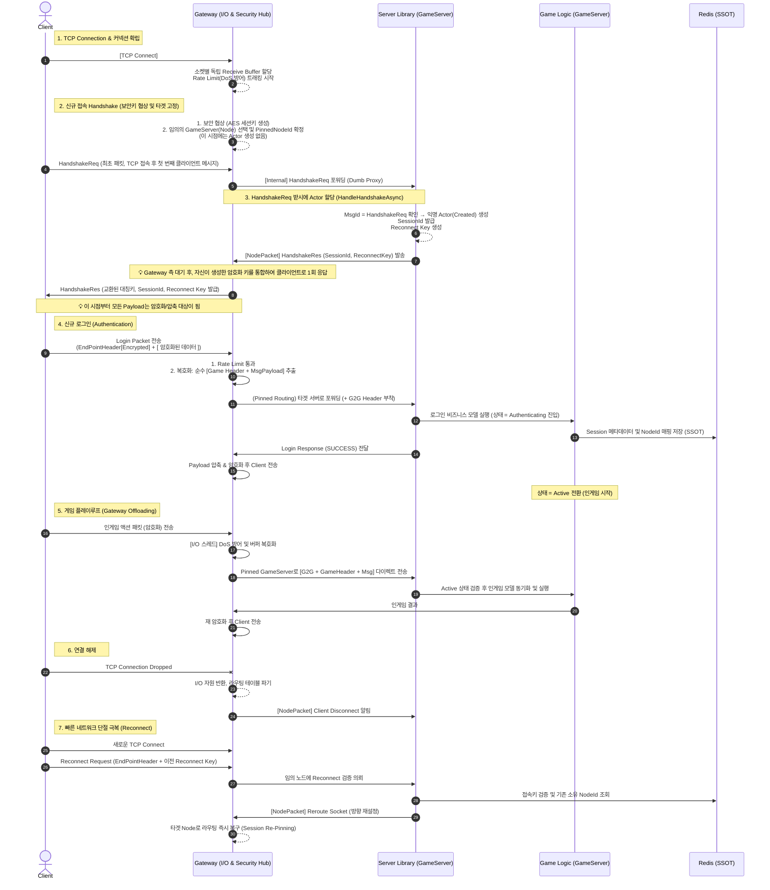

# 네트워크 패킷 구조 및 시퀀스 명세

**레이어:** Data Plane / Control Plane 통합
**목적:** 네트워킹 이원화(Network Dualism)를 뒷받침하는 패킷 계층 구조 및 Gateway 라우팅 시퀀스 정의

---

## 목차
1. [패킷 3대 구조 및 4대 헤더](#패킷-3대-구조-및-4대-헤더)
2. [이중 헤더(Dual Header) 캡슐화 설계](#이중-헤더dual-header-캡슐화-설계)
3. [Gateway ↔ GameServer 실행 및 처리 시퀀스](#gateway--gameserver-실행-및-처리-시퀀스)

---

## 패킷 3대 구조 및 4대 헤더

시스템은 I/O 오프로딩 아키텍처를 지원하기 위해 통신 구간에 따라 3개의 패킷 채널을 정의하고, 이를 4가지 헤더 종류로 조립합니다.

### 📦 3대 패킷 구조 (통신 구간 기준)

1. **EndPointPacket (C2S)**
   - **구간**: `Client` ↔ `Gateway` (TCP 인터넷 망)
   - **목적**: 무거운 네트워크 I/O 방어, TCP 단편화 조립(Framing), SSL/TLS 기반 Handshake 및 보안을 전담하는 외곽 패킷.
2. **GameSessionChannelPacket (G2G)**
   - **구간**: `Gateway` ↔ `GameServer` (내부 P2P 망)
   - **목적**: 외부에서 받은 암호화된 데이터를 복호화해 껍데기를 벗긴 후, "누구(Session)의 것인가" 식별 표표지를 붙여 비즈니스 서버로 던지는 배달부(Envelope) 패킷.
3. **NodePacket (N2N)**
   - **구간**: `Node` ↔ `Node` (서버 간 Service Mesh)
   - **목적**: 게임 플레이와 무관하게 시스템이 스스로 라우팅(`Pin Session`, `Kickout`)을 제어하기 위한 관리망 패킷.

### 🔖 4대 헤더 맵핑
1. **[Header 1] EndPoint Header**: 패킷 Framing 및 암호화 여부 조율용. 항상 **평문(Plain)** 전송. (`TotalLength`, `Flags`)
2. **[Header 2] Game Header**: 내부망 순수 비즈니스 로직용 헤더. (암호화되어 전송) (`MsgId(OpCode)`, `SequenceId`, `AckSequenceId`)
3. **[Header 3] GSC Header**: Gateway와 GameServer간 통신할 때 사용하는 라우팅 식별자. (`NodeId`, `SocketId`)
4. **[Header 4] Node Header**: 서버 노드 간 메시지 송수신 및 RPC용. (`Sender`, `Target`, `RequestId`)

---

## 이중 헤더(Dual Header) 캡슐화 설계

클라이언트가 전송하는 최종적인 비즈니스 패킷(`EndPointPacket`)은 가장 명확한 캡슐화 형태를 취합니다. 외부 인터넷망을 통과하는 순간은 오직 아래와 같이 처리됩니다.

💡 **클라이언트 송수신 최종 패킷 구조:**
> `EndPointHeader [ GameHeader [ Msg / Payload ] ]`

| 패턴 명칭 | 용도 및 설명 | 구조 예시 |
|---|---|---|
| **Handshake Request/Response** | • TCP 연결 직후 최초 1회만 주고받는 제어 패킷 • 대칭키 교환 및 Reconnect Key 발급 목적 • **전체 평문** 전송 | `EndPointHeader(TotalLength, Flags(Handshake))` |
| **Encrypted Stream Packet** | • 인증 완료 후 주고받는 비즈니스/인게임 패킷 • Gateway가 바깥 헤더를 보고 Payload를 복호화함 | `EndPointHeader(Length, Flags(Encrypted))` + **[ 암호화 시작 ]** `GameHeader` + `MsgPayload` **[ 암호화 끝 ]** |
| **Reconnect Request** | • 네트워크 순단 복구용 우회 패킷 | `EndPointHeader(Length, Flags(Reconnect))` + `Payload(Reconnect Key)` |

---

## Gateway ↔ GameServer 실행 및 처리 시퀀스

최전방 Gateway에서 **Rate Limit, 암호화, 압축 등 무거운 I/O**를 모두 오프로딩(전담)하고, GameServer는 순수 비즈니스 틱에만 집중하는 흐름입니다.

